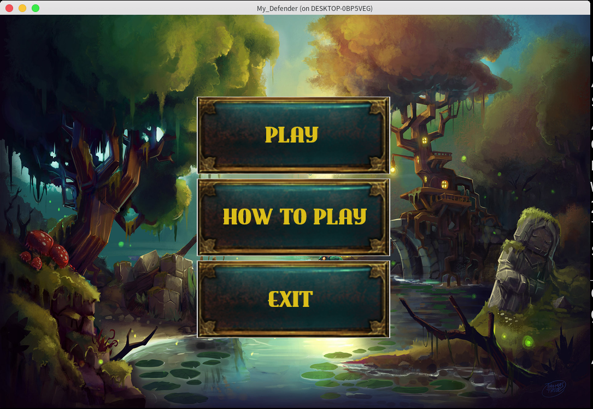

# My_defender

## A Tower Defense game coded in C with the CSML library


## Usage

``` zsh
make
./my_defender
```
With this project I learned graphical programming, and how to use CFSML and collaborating with a mate.

I made this project with Victor Harri-Chal.
___
Check my [portfolio](http://simonlefourn.com) for more informations on this project.

